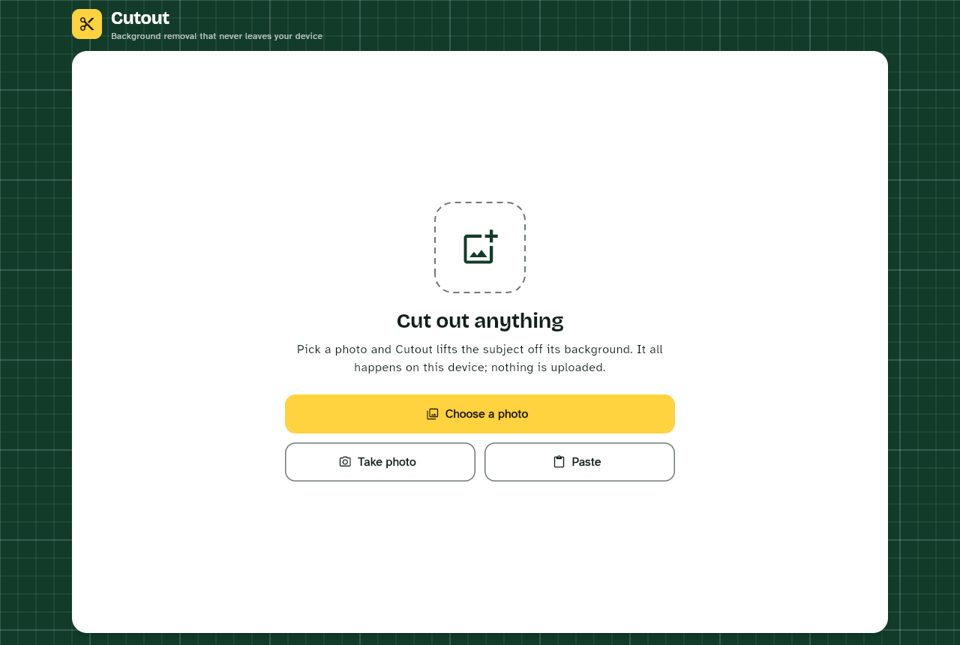
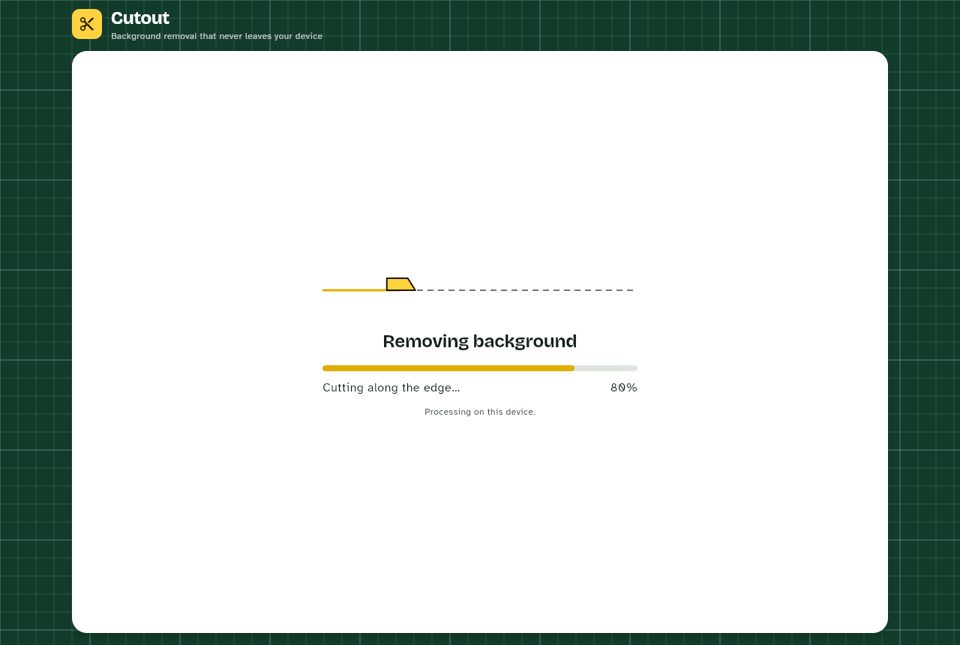
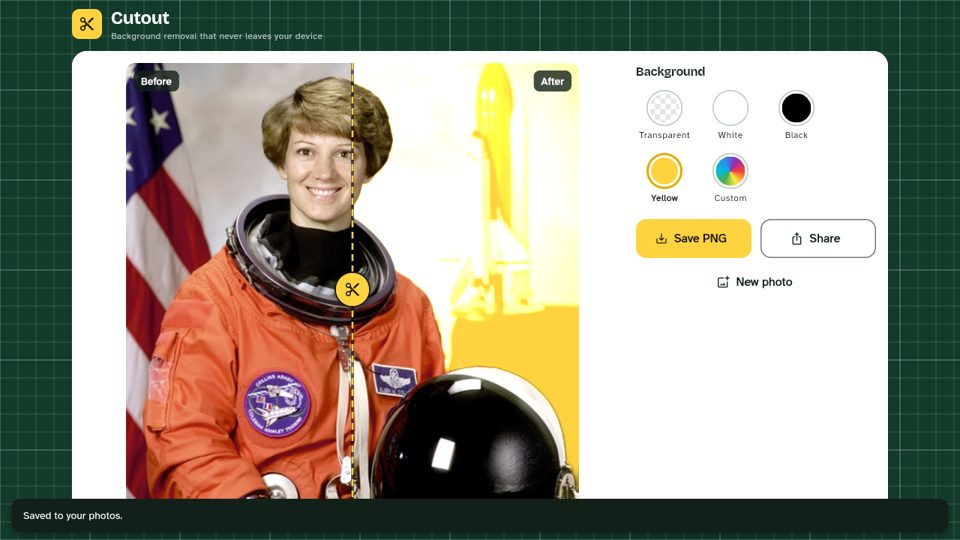

# Cutout

Cutout is a Flutter app that removes image backgrounds **entirely on-device**.
It calls no cloud API and uploads nothing: the photo is decoded, segmented by a
bundled ONNX model and composited on the phone (or in the browser tab).

Targets: **iOS, Android and web**.

| Start | Processing | Result (compare slider) |
| --- | --- | --- |
|  |  |  |

## Features

- **Input:** pick from the gallery, take a photo with the camera, or paste an
  image from the clipboard (Android, iOS, web; Ctrl/⌘+V works too).
- **On-device segmentation** with U²-Net (`u2netp`) running in ONNX Runtime.
  Inference and all pixel work happen in a background isolate, so the UI keeps
  animating.
- **Progress indicator** that reports each step: reading the image, preparing
  pixels, finding the subject, cutting along the edge, finishing up.
- **Before/after compare slider** over a transparency checkerboard. Drag it,
  tap to jump, use the arrow keys, or use screen-reader increase/decrease.
- **Backgrounds:** transparent, white, black, yellow, or a custom colour
  (colour wheel plus hex input).
- **Export:** saves a full-resolution PNG to the photo library, or shares it
  through the system share sheet. On web, "Save" downloads the PNG instead.
- **New photo** resets the editor.
- **Clear errors** for images that are too large (over 32 MP or 60 MB),
  unreadable files, denied camera or photo permissions, an empty clipboard,
  running out of memory, and save failures.
- **Design:** a dark-green cutting mat with a grid, a white work surface, a
  yellow "blade" accent and a dashed cutting line on the slider handle.
  Headings use Bricolage Grotesque and body text uses Atkinson Hyperlegible.
  Material 3 in light and dark themes, 48 dp minimum tap targets, and
  reduced-motion support (the blade animation and transitions stop).

## How it works

```
bytes ──► dart:ui codec (native, off the UI thread, applies EXIF rotation)
            │  size check from the header: ≤ 32 MP
            ▼
        RGBA pixels ──TransferableTypedData──►  background isolate
                                                 │ area-average resize to 320×320
                                                 │ normalise (ImageNet mean/std), NCHW
                                                 │ ONNX Runtime: u2netp
                                                 │ min-max normalise mask
                                                 │ bilinear upscale to full res
                                                 │ mask → alpha channel
        cutout RGBA ◄──TransferableTypedData─────┘
            │
            ▼
   compare slider · composite over chosen colour · PNG encode (engine)
```

- `lib/features/segmentation/domain/mask_ops.dart` holds the pure,
  unit-tested pixel maths: pre-processing, mask normalisation, upscaling,
  alpha application, and Porter-Duff compositing.
- `lib/features/segmentation/data/segmentation_runner_io.dart` runs a
  long-lived worker isolate that owns the ONNX session. It uses
  `BackgroundIsolateBinaryMessenger` so plugin calls work from that isolate.
  On Android and iOS the plugin also runs inference on a native background
  queue.
- On web, Dart isolates can't host plugins, so
  `segmentation_runner_web.dart` runs the same pipeline on the main thread
  and yields between steps. ONNX Runtime Web inference is asynchronous.

### Project structure

```
lib/
  main.dart, app.dart
  core/
    imaging/image_codec.dart        decode / encode via dart:ui, size limits
    theme/                          palette, Material 3 theme, fonts
    widgets/                        cutting mat, checkerboard
  features/
    segmentation/
      segmentation_service.dart     public API: cut(bytes) → CutResult
      domain/                       model config, pixel ops, types
      data/                         ONNX pipeline + isolate/web runners
    input/image_input_service.dart  gallery, camera, clipboard
    export/export_service.dart      PNG render, gallery save, share, web download
    editor/                         controller, screen, compare slider, pickers
assets/
  models/u2netp.onnx                4.4 MB, Apache-2.0
  google_fonts/                     bundled TTFs (OFL), so text works offline
web/ort/                            vendored onnxruntime-web (MIT)
test/                               unit + widget tests
integration_test/                   end-to-end cut with the real model
```

## Setup

Requirements: Flutter **3.47+** (Dart 3.13). Builds for iOS need Xcode 16+;
builds for Android need the Android SDK (minSdk 24).

```bash
flutter pub get
flutter run            # choose a connected device, simulator or emulator
flutter run -d chrome  # web
```

- **iOS:** the deployment target is **16.0**, and CocoaPods must use static
  linkage, as ONNX Runtime requires. Both are already set in `ios/Podfile` and
  the Xcode project. `flutter run` runs `pod install` for you. Camera and
  photo-library usage strings are in `ios/Runner/Info.plist`.
- **Android:** `minSdk 24`. `android/app/proguard-rules.pro` keeps the ONNX
  Runtime JNI classes for release builds with R8. The manifest declares
  `CAMERA` (image_picker requests it at runtime) and `WRITE_EXTERNAL_STORAGE`
  for API ≤ 28 only. Android 10+ saves without a storage permission, and
  picking uses the system Photo Picker.
- **Web:** ONNX Runtime Web is vendored in `web/ort/` and CanvasKit is served
  from the app (`web/flutter_bootstrap.js`), so neither comes from a CDN. If
  the page is served with cross-origin isolation (COOP/COEP headers),
  inference uses several threads; otherwise it uses one.

### Checks

```bash
flutter analyze
flutter test                                   # unit + widget tests
flutter test integration_test -d <device-id>   # full cut with the real model
```

The integration test cuts a generated scene. It drives the real UI, model and
isolate, checks that the mask separates the subject, confirms the UI isolate
stays responsive during the cut, and exports a PNG. On desktop you can point it
at a real photo:

```bash
flutter test integration_test -d linux \
  --dart-define=CUTOUT_FIXTURE=/path/to/photo.jpg \
  --dart-define=CUTOUT_OUT=/tmp/cutout-out   # writes cutout.png and a screenshot
```

(Linux isn't a shipping target. Add it locally with
`flutter create --platforms linux .` if you want to run that.)

## Android release pipeline

`.github/workflows/android.yml` runs on every push to any branch (and on `v*`
tags). It checks formatting, runs `flutter analyze` and the tests, then builds
a release **Android App Bundle**, the format Google Play requires. The bundle,
its R8 `mapping.txt` and the Dart debug symbols are attached to the run as an
artifact (kept for 30 days). Download them from the run's **Summary** page.

- **Version code** is the workflow run number, so every build is higher than
  the last, as Play requires. The version name comes from `pubspec.yaml`.
- **Signing** uses your Play *upload key* from repository secrets. Without
  them the bundle is debug-signed: the run still succeeds, with a warning and
  an artifact name ending in `-debug-signed`, but Play will reject that file.
- **Target SDK** is Flutter's default (API 36) and native libraries support
  16 KB page sizes, both of which Play currently requires.

### One-time setup: the upload key

1. Create an upload keystore. Keep it and its passwords safe; you need the
   same key for every future update.

   ```bash
   keytool -genkeypair -v -keystore upload-keystore.jks -storetype JKS \
     -keyalg RSA -keysize 2048 -validity 10000 -alias upload
   ```

2. In GitHub → **Settings → Secrets and variables → Actions**, add:

   | Secret | Value |
   | --- | --- |
   | `ANDROID_UPLOAD_KEYSTORE_BASE64` | output of `base64 -w0 upload-keystore.jks` (macOS: `base64 -i upload-keystore.jks`) |
   | `ANDROID_UPLOAD_STORE_PASSWORD` | the keystore password |
   | `ANDROID_UPLOAD_KEY_ALIAS` | `upload` (or the alias you chose) |
   | `ANDROID_UPLOAD_KEY_PASSWORD` | the key password |

3. In Play Console, create the app (package `com.kapetaltd.cutout`), turn on
   **Play App Signing**, and upload the first signed `.aab` from a workflow
   run by hand. Google then holds the app signing key, and your upload key
   only proves uploads come from you.

To build a signed bundle locally instead, create `android/key.properties`
(gitignored):

```properties
storeFile=/absolute/path/to/upload-keystore.jks
storePassword=...
keyAlias=upload
keyPassword=...
```

then run `flutter build appbundle --release`.

### Optional: automatic upload to Play

Add a `PLAY_SERVICE_ACCOUNT_JSON` secret: a Google Cloud service-account key
that has been granted release access to the app in Play Console (**Users and
permissions**). With it, every push to `main` also uploads the signed bundle
to the **internal testing** track as a *draft*, which you then review and roll
out in Play Console. The Play API can't create an app or its first release,
so the first upload in step 3 above must be manual.

## Privacy

- Images never leave the device. There are no network calls in the
  decode → segment → export path.
- The model, ONNX Runtime Web and the app's fonts all ship with the app.
- One caveat on **web**: Flutter's web engine loads its default/fallback
  fonts (Roboto, Noto Symbols) from `fonts.gstatic.com` when a glyph needs
  them. These are font downloads only and send no user data. To remove them
  completely, host the fonts yourself and set `fontFallbackBaseUrl` in
  `web/flutter_bootstrap.js`.

## Licences

| Component | Licence | Source |
| --- | --- | --- |
| **U²-Net `u2netp` model** (`assets/models/u2netp.onnx`) | **Apache-2.0** | [xuebinqin/U-2-Net](https://github.com/xuebinqin/U-2-Net). ONNX export as distributed by [rembg](https://github.com/danielgatis/rembg/releases/tag/v0.0.0), SHA-256 `309c8469…c4ddd8`. Full text and attribution in `assets/models/LICENSE-u2netp.txt`. |
| ONNX Runtime / onnxruntime-web 1.23 | MIT | Microsoft. `web/ort/LICENSE` |
| Bricolage Grotesque, Atkinson Hyperlegible | SIL OFL 1.1 | `assets/google_fonts/OFL-*.txt` |

U²-Net: Qin et al., *"U²-Net: Going Deeper with Nested U-Structure for Salient
Object Detection"*, Pattern Recognition 106 (2020). Apache-2.0 allows
commercial use. Keep the licence file and attribution when you redistribute
the model.

## Swapping models

All model-specific values live in one place:
`lib/features/segmentation/domain/segmentation_model_config.dart`.

1. Put the `.onnx` file in `assets/models/` (that folder is already
   declared in `pubspec.yaml`).
2. Add a config that matches the model's reference pre-processing:

   ```dart
   static const isnetGeneral = SegmentationModelConfig(
     id: 'isnet-general-use',
     assetPath: 'assets/models/isnet-general-use.onnx',
     inputSize: 1024,
     mean: [0.5, 0.5, 0.5],
     std: [1.0, 1.0, 1.0],
     normalization: MaskNormalization.minMax,
   );
   ```

   - `inputSize`: the square input edge (`[1, 3, N, N]`).
   - `mean` / `std`: per-channel normalisation of 0..1 RGB. Copy them from the
     model's reference code; for rembg-distributed models, look in rembg's
     matching `sessions/*.py`.
   - `inputName` / `outputIndex`: which tensor to feed and which output holds
     the mask. By default these are the first input and the first output.
   - `normalization`: `minMax` (U²-Net/ISNet style), `sigmoid` (for logit
     outputs), or `clamp` (for probability outputs).
3. Point `SegmentationModelConfig.active` at the new config.
4. Add the model's licence next to it and update the table above. **Check the
   licence first.** For example, briaai RMBG-1.4/2.0 are *not* licensed for
   commercial use, while ISNet and U²-Net are Apache-2.0.

The on-device copy of the model is named by content hash, so a swapped model
is never served from a stale cache. Larger inputs (1024²) give crisper edges
but take roughly 10× the compute of u2netp's 320².

## Why ONNX + U²-Net rather than ML Kit?

**Google ML Kit Subject Segmentation** was evaluated and not adopted:

| | ONNX + u2netp (chosen) | ML Kit Subject Segmentation |
| --- | --- | --- |
| Platforms | iOS, Android, web from one pipeline | **Android only** (iOS would need Apple Vision, iOS 17+, as a second code path; no web) |
| Quality | Good on clear subjects; soft edges from the 320² mask | Generally sharper edges and better multi-subject handling |
| Model delivery | Bundled 4.4 MB, works offline on first run | Downloaded by Google Play services on first use; needs Play services |
| Licence / control | Apache-2.0 weights, swappable (see above) | Proprietary model; Google ML Kit terms |
| App size | about +4.4 MB model, plus the ORT native libs | Small app; model lives in Play services |

ML Kit would mean three backends (ML Kit, Vision, ONNX for web) and a Play
services dependency, in exchange for better edges on Android only. If edge
quality becomes the priority, the clean next step is to keep this
architecture and swap in a higher-resolution Apache-2.0 model such as ISNet
(see above), or add an Android-only `SegmentationRunner` that uses ML Kit
behind the same `SegmentationService` interface.

## Known limitations

- u2netp predicts at 320×320, so hair and fine edges come out soft. That's
  the trade-off for a 4.4 MB model.
- The maximum input is 32 MP / 60 MB. The picker asks the OS to downscale
  photos to a 5600 px long edge, so camera photos fit.
- HEIC decoding depends on the platform codecs: it works on iOS and modern
  Android, but not in most browsers.
- On web, the pixel steps run on the main thread (no plugin isolates). A 9 MP
  image cuts in about 5 s in headless Chromium.
